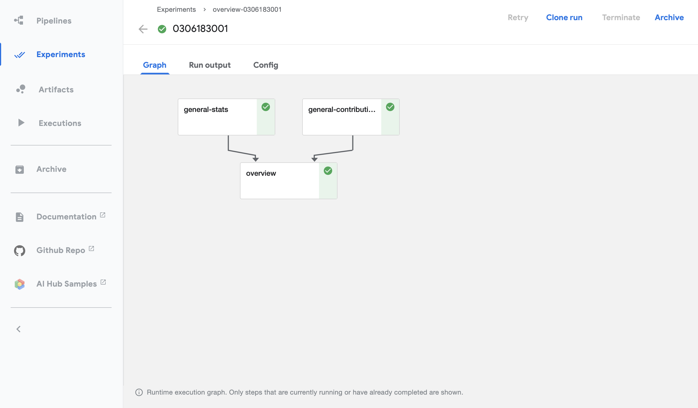

<!--

Copyright 2018-2021 Elyra Authors

Licensed under the Apache License, Version 2.0 (the "License");
you may not use this file except in compliance with the License.
You may obtain a copy of the License at

http://www.apache.org/licenses/LICENSE-2.0

Unless required by applicable law or agreed to in writing, software
distributed under the License is distributed on an "AS IS" BASIS,
WITHOUT WARRANTIES OR CONDITIONS OF ANY KIND, either express or implied.
See the License for the specific language governing permissions and
limitations under the License.

-->

KFP-Notebook is an operator that enable running notebooks as part of a Kubeflow Pipeline.


## Building kfp-notebook

```bash
make clean install
```

## Usage

The example below can easily be added to a `python script` or `jupyter notebook` for testing purposes.

```python
import os
import kfp
from kfp_notebook.pipeline import NotebookOp
from kubernetes.client.models import V1EnvVar

# KubeFlow Pipelines API Endpoint
kfp_url = 'http://dataplatform.ibm.com:32488/pipeline'

# S3 Object Storage
cos_endpoint = 'http://s3.us-south.cloud-object-storage.appdomain.cloud'
cos_bucket = 'test-bucket'
cos_username = 'test'
cos_password = 'test123'
cos_directory = 'test-directory'
cos_dependencies_archive = 'test-archive.tar.gz'

# Inputs and Outputs
inputs = []
outputs = []

# Container Image
image = 'tensorflow/tensorflow:latest'

def run_notebook_op(op_name, notebook_path):

    notebook_op = NotebookOp(name=op_name,
                             notebook=notebook_path,
                             cos_endpoint=cos_endpoint,
                             cos_bucket=cos_bucket,
                             cos_directory=cos_directory,
                             cos_dependencies_archive=cos_dependencies_archive,
                             pipeline_outputs=outputs,
                             pipeline_inputs=inputs,
                             image=image)

    notebook_op.container.add_env_variable(V1EnvVar(name='AWS_ACCESS_KEY_ID', value=cos_username))
    notebook_op.container.add_env_variable(V1EnvVar(name='AWS_SECRET_ACCESS_KEY', value=cos_password))
    notebook_op.container.set_image_pull_policy('Always')

    return op

def demo_pipeline():
    stats_op = run_notebook_op('stats', 'generate-community-overview')
    contributions_op = run_notebook_op('contributions', 'generate-community-contributions')
    run_notebook_op('overview', 'overview').after(stats_op, contributions_op)

# Compile the new pipeline
kfp.compiler.Compiler().compile(demo_pipeline,'pipelines/pipeline.tar.gz')

# Upload the compiled pipeline
client = kfp.Client(host=kfp_url)
pipeline_info = client.upload_pipeline('pipelines/pipeline.tar.gz',pipeline_name='pipeline-demo')

# Create a new experiment
experiment = client.create_experiment(name='demo-experiment')

# Create a new run associated with experiment and our uploaded pipeline
run = client.run_pipeline(experiment.id, 'demo-run', pipeline_id=pipeline_info.id)

```

## Generated Kubeflow Pipelines


